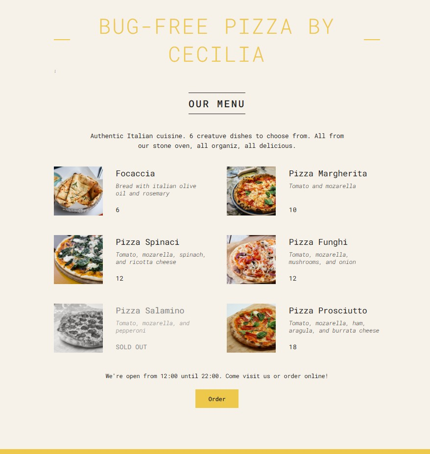

# Bug-Free Pizza by Cecilia



Este é um projeto React simples que exibe um menu de uma pizzaria fictícia chamada "Bug-Free Pizza by Cecilia".

## Funcionalidades

- Exibe um menu de pizzas com nome, ingredientes, preço e imagem.
- Indica se uma pizza está esgotada.
- Mostra o horário de funcionamento da pizzaria.
- Permite fazer um pedido online (funcionalidade simulada).

## Tecnologias Utilizadas

- React (versão 19.0.0)
- CSS

## Guia de Instalação

1.  **Pré-requisitos:**

    - Certifique-se de que você tem o Node.js e o npm (Node Package Manager) instalados no seu computador. Você pode baixar e instalar o Node.js em [https://nodejs.org/](https://nodejs.org/). O npm é instalado automaticamente com o Node.js.

2.  **Clone o repositório:**

    ```bash
    git clone [https://github.com/ceferrei/pizza-menu-react.git](https://github.com/ceferrei/pizza-menu-react.git)
    ```

3.  **Navegue até o diretório do projeto:**

    ```bash
    cd pizza-menu-react
    ```

4.  **Instale as dependências:**

    ```bash
    npm install
    ```

    - Este comando irá instalar todas as dependências do projeto listadas no arquivo `package.json`.

5.  **Inicie o servidor de desenvolvimento:**

    ```bash
    npm start
    ```

    - Este comando irá iniciar o servidor de desenvolvimento do React e abrir o projeto no seu navegador padrão em `http://localhost:3000`.

## Estrutura do Projeto

pizza-menu-react/
├── public/
│ ├── index.html
│ └── ...
├── src/
│ ├── components/
│ │ ├── Header.js
│ │ ├── Menu.js
│ │ ├── Pizza.js
│ │ ├── Footer.js
│ │ └── Order.js
│ ├── pizzas/
│ │ ├── focaccia.jpg
│ │ ├── margherita.jpg
│ │ ├── spinaci.jpg
│ │ ├── funghi.jpg
│ │ ├── salamino.jpg
│ │ └── prosciutto.jpg
│ ├── App.js
│ ├── index.js
│ └── index.css
├── package.json
├── package-lock.json
└── README.md

## Melhorias Futuras

- Adicionar um carrinho de compras.
- Implementar um formulário de pedido real.
- Melhorar o design e a responsividade.
- Adicionar testes unitários e de integração.
- Adicionar mais informaçoes sobre a pizzaria.

## Licença

Este projeto está licenciado sob a licença [MIT](https://opensource.org/licenses/MIT).
